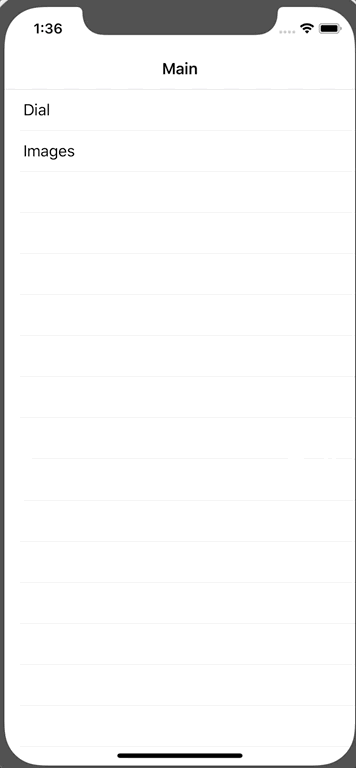

# LMCenteredCollectionView


## Introduction

`LMCenteredCollectionView` is a infinite scroll view. 

## Example

              

## Usage

Create your cell,

```swift
class YourCell: LMCenteredCollectionViewCell {}
```

Then show centeredCollectionView in `YourViewController`,

```swift
class YourViewController: UIViewController {
    private var centeredCollectionView: LMCenteredCollectionView!
    
    override func viewDidLoad() {
        centeredCollectionView = LMCenteredCollectionView(frame: UIScreen.main.bounds, direction: .horizontal)
        centeredCollectionView.register(YourCell.self)
        view.addSubview(centeredCollectionView)
    }
}
```

You must implement `dataSource` to show your contents,


```swift
centeredCollectionView.dataSource = self

extension YourViewController: LMCenteredCollectionViewDataSource {
    func numberOfItems(in centeredCollectionView: LMCenteredCollectionView) -> Int {
        return 10
    }
    
    func centeredCollectionView(_ centeredCollectionView: LMCenteredCollectionView, cellForItemAt index: Int) -> LMCenteredCollectionViewCell {
        let cell = centeredCollectionView.dequeueReusableCell(for: index) as! YourCell
        return cell
    }
}
```

Implementing `delegate` if you want to resize items and spacing between items. The default size is (50, 50) and the interitemSpacing is 10.

For more control you can see `LMCenteredCollectionViewDelegate` for detail.

```swift
centeredCollectionView.delegate = self

extension YourViewController: LMCenteredCollectionViewDelegate {
    func sizeOfItems(in centeredCollectionView: LMCenteredCollectionView) -> CGSize {
        return CGSize(width: 50, height: 50)
    }
    
    func interitemSpacingBetweenItems(in centeredCollectionView: LMCenteredCollectionView) -> CGFloat {
        return 10
    }
}
```


## Installation

### CocoaPods

Add `LMCenteredCollectionView` in your `Podfile`.
```ruby
pod 'LMCenteredCollectionView'
```

Then,
```bash
pod install
```

### Manual

Copy `Sources` folder to your project. That's it.

## Licence

The MIT License (MIT)
